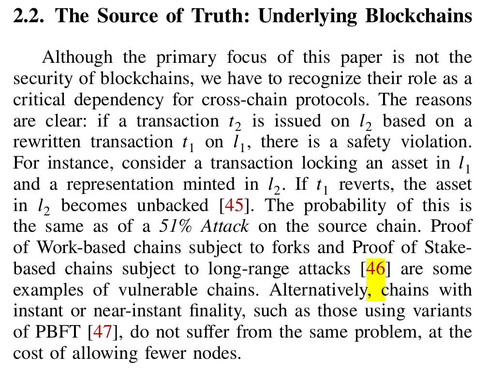

# Objectives:
To undercore the what is consensus security.

Why consensus make sense? 33%? not too heavy.

To fill the gap between Consensus and chain eco.
It's not un-practical.

What's the workarounds?
What's the solutions?
What's the 

# Layout
- Ethereum
- consensus model? why it is a threat?
    - How consensus works: layered-implementation
    - to define key consensus interfaces;
    - 33%? to provide consensus distributed system's background to blockchain researchers.
    - profit > cost = attack;
    - the ground truth, it's not un-feasible.
- Consensus Attacks and it's impact: from simulation;
    > What are the cross-chain vulnerabilities, attack vectors, privacy leaks, and mitigations currently known, and how are they mapped to past incidents?

    - define a set of properties.
    - to define key consensus attack primitives.
    - to explore technical building blocks of attacks.
    - and from definition to our simulation:
    - Implications: 
        - when consensus break;
        - direct issue;

- Further Issue:
    - Restaking
    - Cross-chain: revert
        - like this in cross-chain SoK:
    - shorting on native token: 
        - the paper: [Proof-of-Stake at Stake: Predatory, Destructive Attack on PoS Cryptocurrencies](../../../archive/2025/papers/blockchainn20-pos-attack-coin/pos-attack-coin.md)
- 