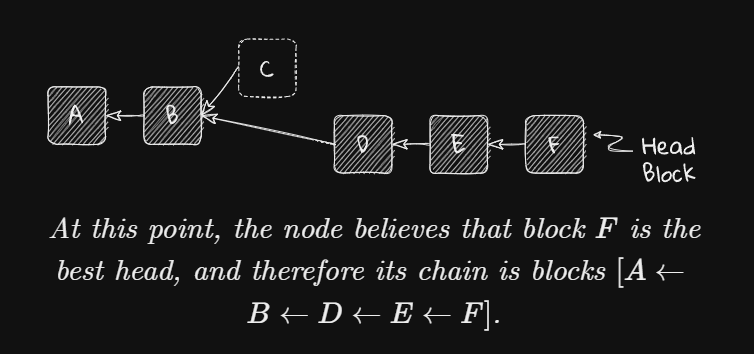

[eth2book-2.3.1-consensus-preliminaries](https://eth2book.info/capella/part2/consensus/)

# Consensus
## Intro
The challenge a consensus protocol seeks to solve is that of building **a reliable distributed system** on top of **unreliable infrastructure**. 

**A Reliable Distributed System**:
- Our goal in Ethereum's consensus layer is to enable tens of thousands of independent nodes around the world to proceed completely in lockstep with each other. Each node maintains a ledger containing the state of every account, and every ledger must match every other ledger. There must be no discrepancies; the nodes must agree, and they must come to agreement swiftly. This is what I mean by "a reliable distributed system".

**Unreliable Infrastructure**:
- These nodes often run on consumer grade hardware. They communicate over Internet connections that might be low bandwidth, or high latency, that lose packets, or drop out for indefinite periods of time. Node operators sometimes misconfigure their software, or don't keep it up to date. And, to make it all the more exciting, there is the possibility of large numbers of bad actors running rogue nodes or tampering with communications for their own gain. This is what I mean by "unreliable infrastructure".

## Byzantine Problem
[1982](https://lamport.azurewebsites.net/pubs/byz.pdf):
> We imagine that several divisions of the Byzantine army are camped outside an enemy city, each division commanded by its own general. The generals can communicate with one another only by messenger. After observing the enemy they must decide on a common plan of action.

This formulation makes clear that there is no overall holistic view, no God-mode in which we can see the whole situation in one glance and make a decision. We are simply one of the generals, and our only source of information about the other generals is the messages that we receive - messages that may be correct, or lies, or mistakes based on limited information, or delayed, or modified in transit. We have only a very limited local view, yet we must come to a view about the state of the whole system.

## BFT solutions
The first mainstream solution was the **Practical Byzantine Fault Tolerance** [(PBFT)](https://www.scs.stanford.edu/nyu/03sp/sched/bfs.pdf)

Nakamoto consensus [(bitcoin)](https://bitcoinpaper.org/bitcoin.pdf), invented by Satoshi Nakamoto for Bitcoin in 2008, takes a fundamentally different approach.

Many, many variants of these and other novel alternatives, such as the [Avalanche family](https://arxiv.org/pdf/1906.08936) of protocols, have since sprung up. Section 7, Related Work, of the [Avalanche white paper](https://arxiv.org/pdf/1906.08936) provides a good survey of the zoo of different consensus protocols currently in use in the blockchain world.

## PoS / PoW
For the most part, both proof of work and proof of stake are **Sybil resistance** mechanisms that *place a cost on participating* in the protocol. We absolutely don't want the attacker to join the network at low-cost.

Such mechanism also provides a useful way to assign a weight, or a score, to a chain of blocks: in proof of work, the total work done; in proof of stake, the amount of value that supports a particular chain.

## Block chains
A block comprises a set of transactions that a leader (the block proposer) has assembled. A block's contents (its payload) may vary according to the protocol.

The use of blocks is an *optimisation*. In principle we could add individual transactions to the chain one by one, but that would add a huge consensus overhead. So blocks are **batches** of transactions, and sometimes people [argue](https://www.bitrawr.com/bitcoin-block-size-debate-explained) about how big those blocks should be.

In Ethereum's execution chain, the block size is limited by the block gas limit (that is, the amount of work needed to process the transactions in the block).

## Block Trees

Why did the proposer of block C build on A rather than B?
- It may be that the proposer of C **had not received** block B by the time it was ready to make its proposal.
- It may be that the proposer of C **deliberately** wanted to exclude block B from its chain, for example to steal its transactions, or to censor some transaction in B.
- It may be that the proposer of C thought that block B was **invalid** for some reason.

The first two reasons, at least, are indistinguishable to the wider network. All we know is that C built on A, and we can never know why for certain.

TO **chase Profit**, the proposer of D may have decided on some basis that there was more chance of the wider network eventually including B than C. Thus, building D on B gives it more chance of making it into the eventual block chain than building D on C.

**Hard Fork**: protocol upgrades that change the rules, making old blocks invalid with respect to the new rules, is sometimes called a "hard fork".

> The existence of forking in a consensus protocol is a consequence of **prioritising liveness over safety**

## Fork Choice Rule
When different nodes have different views on the world state, we want every correct node on the network to agree on an identical linear view of history and hence a common view of the state of the system.

Given a block tree and some decision criteria based on a node's **local view** of the network, the fork choice rule is designed to select, from all the available branches, the one that is most likely to eventually end up in the final linear, canonical chain.

Later we can perhaps see that each of these fork choice rules is a way to **assign a numeric score to a block**.

## Reorgs

## Safety and Liveness
Safety means consistency, Liveness means availability.

Effectively, safety means that our distributed system "behaves *like a centralized implementation* that executes operations atomically one at a time."

> [Vitalik Buterin's Opinion](https://medium.com/@VitalikButerin/the-meaning-of-decentralization-a0c92b76a274)

## CAP
The [CAP theorem](https://groups.csail.mit.edu/tds/papers/Lynch/jacm85.pdf) is a famous result in distributed systems' theory that states that no distributed system can provide all three of (1) **consistency**, (2) **availability**, and (3) **partition tolerance**. 

**Partition tolerance** is the ability to function when communication between nodes is not reliable. For example, a network fault might split the nodes into two or more groups that can't communicate with each other.

Example:

Let's say that somebody connected to the network of group A sends a transaction. If the nodes in A process that transaction then they will end up with a state that is different from the nodes in group B, which didn't see the transaction. So, overall, we have lost consistency between all the nodes, and therefore safety. The only way to avoid this is for the nodes in group A to refuse to process the transaction, in which case we have lost availability, and therefore liveness.

| Index | Want | Loss | Cases |
|------|------|------|------|
| 1 | C+A | P | **Ethereum** is safe and live but can not tolerate partition. |
| 2 | C+P | A | What if we want to be consistent and partition tolerance, then we must refuse to processing TXs, we lost availability. |
| 3 | A+P | C | Waht if we want to be available and partition tolerance then we will never be consistent between partitions. |

The CAP theorem is related to another famous result described by Fisher, Lynch and Paterson in their 1985 paper, Impossibility of Distributed Consensus with One Faulty Process, usually called the FLP theorem. This proves that, even in a reliable asynchronous network (that is, with no bound on how long messages can take to be received), just one faulty node can prevent the system from coming to consensus. That is, even this unpartitioned system cannot formally be both live and safe. Gilbert and Lynch's [paper](https://groups.csail.mit.edu/tds/papers/Gilbert/Brewer2.pdf) discusses the FLP theorem in section 3.2.

## Ethereum's Consensus Trade-off
The Ethereum consensus protocol offers both safety and liveness in good network conditions, but **prioritises liveness** when things are not running so smoothly.

When the network can not reach finalization due to partition (e.g. 50% for A and 50% for B, both A and B can not reach the threshold 2/3), unless the partition is resolved, both sides will finally regain finality due to the novel [inactivity leak mechanism](https://eth2book.info/capella/part2/incentives/inactivity/).

*Forever Lost*: But this results in the **ultimate safety failure**. Each chain will finalise a different history and the two chains will become irreconcilable and independent forever.

## Finality
Some consensus protocols, like classical PBFT, or Tendermint, finalise every round (every block). 

> As soon as a round's worth of transactions has been included on the chain, all the nodes agree that it will be there forever. On the one hand, these protocols are very "safe": once a transaction has been included on-chain, it will never be reverted. On the other hand, they are vulnerable to liveness failures: if the nodes cannot come to agreement – for example, if more than one third of them are down or unavailable – then no transactions can be added to the chain and it will stop dead.

Other consensus protocols, such as **Bitcoin**'s Nakamoto consensus, **do not have any finality mechanism** at all. 

Trade-Off: Ethereum's consensus layer prioritises liveness, but also strives to offer a safety guarantee in the form of finality when circumstances are favourable. This is an attempt to gain the best of both worlds. Vitalik has [defended this](https://ethresear.ch/t/explaining-the-liveness-guarantee/4228/8?u=benjaminion).

## Ideal Target
Our ideal for the systems we are building is that they are politically decentralised (for permissionlessness and censorship resistance), architecturally decentralised (for resilience, with no single point of failure), but logically centralised (so that they give consistent results). These criteria strongly influence how we design our consensus protocols. Vitalik explores these issues in his article, [The Meaning of Decentralization](https://medium.com/@VitalikButerin/the-meaning-of-decentralization-a0c92b76a274).

# Reading:
- [7 block reorg write-up](https://barnabe.substack.com/p/pos-ethereum-reorg)
- [VB's Opinion in Finality](https://blog.ethereum.org/2016/05/09/on-settlement-finality)

# Insights
- different size of network may change the characteristics of consensus.
- what's the cost of reorg? can rewinding be used to DoS?