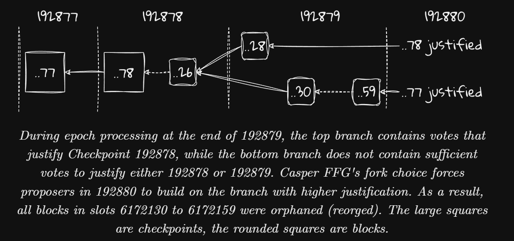

[eth2book-2.3.2-consensus-overview](https://eth2book.info/capella/part2/consensus/overview/)

# Consensus

## Terminology 

### Nodes and Validators:
- **Node**: main participants in the Ethereum network are nodes.A node's role is to *validate* consensus and form the *communication* backbone with other nodes.
- **Validator**: Consensus is formed by validators, which (in true Ethereum style) are horribly misnamed, as they don't really validate anything - that's done by the nodes.
- A validator means 32 ETH stake.
- Validators are attached to nodes, and **a single node can host a lot of** validators.
- Validators attached to the same node do not act independently, they share the same view of the world.
- under PoS, we know our validator set. We have **a complete list of all the public keys** that we expect to be active at any time. Knowing our validator set enables us to achieve finality, as we can identify when we have achieved a majority vote of participants.

### Slots and Epochs
- 1 Epoch = 32 slots = 32 * 12 seconds = 6.4 minutes;

### Blocks and Attestations
- The block contains **updates to the beacon state**, including attestations that the proposer knows about, as well as the execution payload containing Ethereum user transactions.
- The proposer shares its block with the whole network via a gossip protocol.
- an empty slot is allowed when block is missing/reorged/invalid.
- Every epoch, one validator can share its view via Attestation once.
    - LMD-GHOST vote and Casper vote.
- Why **Epoch**?
    - for spreading out the workload of votes.

### Slashing
To prevent Nothing-at-stake issue; Validators can be slashed if they perform equivocate things, e.g. proposing two blocks in one same slot etc.

### Gasper
Gasper = LMD-GHOST + Casper FFG = HLMD-GHOST

LMD-GHOST provides slot-by-slot **liveness**, keeping the chain running;
Casper FFG provides **safety**, protecting the chain from reversions;

When we say that Casper FFG overlays an existing block proposal mechanism, we mean that it takes **an existing block tree and prunes it in a specific way**. 

## Casper FFG's fork choice can cause long reorgs
[link](https://eth2book.info/capella/part2/consensus/issues/)

HLMD-GHOST will start with the chain with the **highest justified checkpoint**, while it can lead to long-reorg.

An incident happened on **Ethereum's Goerli testnet**;

If the bottom fork had remained canonical in epoch 192880, any validator following the top fork, and not seeing the blocks on the bottom fork until much later, would be forced eventually to move its justified epoch back from 192878 to 192877, potentially requiring them to make slashable surround votes in future.

Choosing the highest Justified CP is to avoid slashing?

[A Fix: EIP-7045](https://eips.ethereum.org/EIPS/eip-7045)

# Reading
- [Real Long-Reorg Analysis](https://web.archive.org/web/20230922104428/https://nitter.net/potuz1/status/1685736037321166848)
- [7 block reorg write-up](https://barnabe.substack.com/p/pos-ethereum-reorg)
    - Proposer Boost related.

# Insights
- Not All users applied Proposer Boost.
- Sometimes nodes can know that this chain is going to be reorged since Casper issue would only be updated on the epoch boundary.
    - A wise node should make blocks/votes on the target chain rather than the current chain.