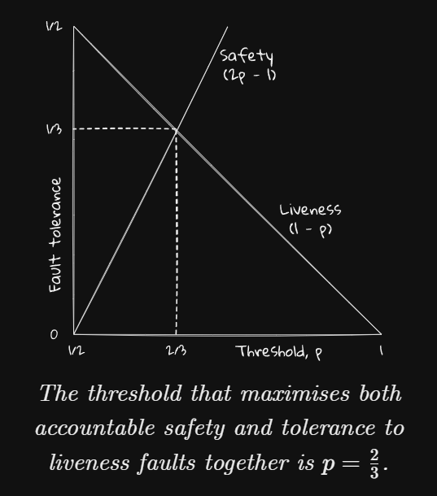

# LMD-GHOST & Casper FFG

## LMD GHOST
[2.3.3](https://eth2book.info/capella/part2/consensus/lmd_ghost/)
### Name
- GHOST:Greedy Heaviest-Observed Sub-Tree: 
    - GHOST's fork choice doesn't follow the heaviest chain, but the **heaviest subtree**;
    - It recognises that a vote for a block is not only for that block, but implicitly a vote for each of its ancestors as well, so whole subtrees have an associated weight.
- LMD: only the **latest message** from each validator;

### Details
#### LMD
Message == GHOST Vote == **Head Block**

```
class AttestationData(Container):
    slot: Slot
    index: CommitteeIndex
    # LMD GHOST vote
    beacon_block_root: Root
    # FFG vote
    source: Checkpoint
    target: Checkpoint
```

MEssage is received via:
- attesatation gossip(vote broadcast);
- within block(block broadcast);

When **receiving**:
- *on_attestation()* validation:
    - Not too old: 
        - must be from the current or previous **epoch**. 
        - *Attestation consideration delay*(duration between vote's broadcasting and inclusion)
    - Not too new:
        - must be from no later than the **previous slot**;
        - 不理解，Receive经常发生在当前slot内啊。
    - Do we have the target Head Block?
        - if not, we might try to **fetch it from a peer**.
    - signature;
    - slashable;
- After validation:
    - insert the vote into Node's local Store.
    - And update the latest Messages via *update_latest_messages()*;
    - Note that a vote can be inserted in the store only if we heard about it in the same epoch or the epoch after it was made. However, once it is in the store it **remains there indefinitely**, and continues to contribute to the fork choice until it is updated with a more recent vote.

Local View == Store
- local tree
- latest messages
- weights

#### Weight


if two branches have equal weight? choose arbitrarily(?).
- with the highest block hash value


#### Intuition
Even two votes with different Head, but with same parent, should be considered to prefer the parent simultaneously. Then the weight of the parent will be added twice. while Two votes has disagreement on the children part.

#### Confirmation rule
With all this info, how to make sure some blocks are determined and will less likely to be reverted?
- Finality rules.

A workaround which imitates the PoW heuristic way to confirm blocks:
- for a block `b`, maintain 2 values: `q` / `q_{min}`;
- rule: 
    - `q > q_{min}` and the network is nearly sync;
    - the block is **safe**;
- q(b, n):
    - the weight of subtree rooted from block `b` at slot `n` **/** total votes after block `b`'s produce.
    - like if in ideal case, block b is produced at slot n:
        - now is slot n+10, so in the view of now, q(b, n+10) = weight of subtree / 11 * committee no. votes;
        - now is slot n, so q(b, n) = weight of subtree / 1 * committee no. votes;

The **idea** is that, once a branch up to block b has accumulated a simple** majority of the available voting** weight, then all honest validators will continue to vote for that branch, so it will maintain its majority indefinitely.

#### Incentives
Block proposer should make sure their block is included into the main chain;
voters voting to the mainchain

Voting/Proposing on the mainchain is rewarded while failing will not be penalized since the network assumption is not ideal.

#### SLashing
Is to handle Nothing at stake probloem;
Slashing stake and ejecting the validator from the protocol;

**Proposer**:
- Proposer equivocation is **not detected in-protocol**;
- but relies on a **third-party** constructing a proof of equivocation in the form of a ProposerSlashing object, containing two block headers;
- A subsequent block proposer will include the proof in a block (and be well rewarded for it),

**Voter**:
Similar.

#### Key APIs in SPec for LMD-GHOST:


## Casper
[2.3.4](https://eth2book.info/capella/part2/consensus/casper_ffg/)
### Overall
The effectiveness of Casper FFG really comes down to two big ideas. 
- First, the **two-phase commit** (justification and finalisation) and, 
- second, **accountable safety**.

**Safety**: is ensured when under 1/3 nodes are bad.
**Accountable Safety**: safety is not ensure if more than 1/3 nodes are bad, but, the bad guy would pay a lot if they want to do things evil.

### Terms
- Epochs and checkpoints
    - checkpoint = Epoch number(unique height) + A block hash
- Justification / finalization
    - 
- Source / Targets / links / conflicts
    - A vote will contain: 
- Supermajority links
    - Over 2/3

### Details
Slashing Rules:
- No double vote: two targets with **same height**;
- No surround vote: 

If any rule is violated, **slashing**:
- Not in-protocol, but rely on **external slashing detection services**;
- if recently too many slashing(like bad behavior), all deposits would be forfeit.
- if rare slashing, nearly no deposits would be forfeit.

Fork Choice

### Guarantees
Accountable safety: bad would be punished.
Plausible lliveness: Supermajority links can always be added to produce new finalized checkpoints, provided there exist children extending the finalized chain.

### Exercise
[interesting case](https://eth2book.info/capella/part2/consensus/casper_ffg/#exercise)

### Misc
- 22% of a validator's potential staking rewards come from source votes, and 41% from target votes. Moreover, inaccurate or late source or target votes are penalised by the same amount as the reward.
- If the source vote is incorrect, then it's as if the validator has not voted at all and it receives a full penalty for missing both source and target. 
- **Late penality**: 
    - Source: If a validator's vote is included in a block within **5** slots, then it receives the source vote reward, otherwise it receives a penalty of the same size.
    - Target: If a validator's vote is included in a block within **32** slots, then it receives the target vote reward, otherwise it receives a penalty of the same size；
- Dynamic Node set:
    - Casper cares this issue via **forward/rear validator set**;
    - **Eth2 ignores it**, working around it instead by **severely rate-limiting** validator activations and exits.;
        - That is, it is possible that slightly less than one-third of the stake gets slashed in the event of finalising a conflicting checkpoint.
        - refer: Casper paper;
- k-finality: Gasper use 1-finality. which means 1 distance between justified cp and finalized cp;
- why 2/3?
    - set `p` to the threshold.
    - bad = 1-p; bigger better, can tolerate more faults, **liveness**;
    - slash = 2p -1; bigger better, violation would incur more slash, **accountable safety**;
    - to get a balance: 
- how not to get slashed?
    - do the protocol issue honestly;
    - By far the most common **reason** that validators get **slashed** is due to their secret signing key being run on different nodes at the same time.
- Casper vs PBFT:
    - Casper: two-phase commit overlapping, prefer liveness;
    - PBFT: Prefer safety;
- optimal slashing condition?
- Conflicting justification
    - [link](https://eth2book.info/capella/part2/consensus/casper_ffg/#conflicting-justification)
    - If you want to test your ability to reason about this distributed consensus stuff – and it's not easy – it's worth thinking through why we need both a justified and a finalised status. Why can't I immediately mark as finalised any checkpoint for which I've seen a 2/3 supermajority vote?
    - The key point is that justification is a **local property**; finality is **global**.
- Example
    - [link](https://eth2book.info/capella/part2/consensus/casper_ffg/#simplified-model)
    - 投的票有效，完成justify了；
    - 但是效果（相应的块）丢失了，以为无效了，所以又justify一个新的块
    - 
# Reading
- [YEs/No Confirmation Rule for PoS Ethereum](https://ethresear.ch/t/confirmation-rule-for-ethereum-pos/15454)
    - [More](https://web.archive.org/web/20240422100537/https://www.adiasg.me/confirmation-rule-for-ethereum/)
    - [Paper](https://arxiv.org/abs/2405.00549)
- [RANDAO attack PoS Ethereum](https://ethresear.ch/t/liveness-attack-in-ethereum-pos-protocol-using-randao-manipulation/22241)
- [RLMD GHOST: Security problems of LMD-GHOST](https://arxiv.org/pdf/2302.11326.pdf)

# Insight:
- A Latest Message will remain indefinitely;
- When a tie occurs, arbitrarily choosing is not real random, but with highest block hash.
- How to badly eject benign validators via slashing?
- Honest and Fake Honest motivated by reward?
- Slashing mechanism is performed outside.
- dynamic forfeit rate. can we leverage this to construct low-cost attack?
- De-activation rate: CHURN_LIMIT_QUOTIENT.
- slashing is determined by secret key signing.
    - one secret key for different nodes may incure slashing due to different view of diff nodes.
    - [signer](https://docs.web3signer.consensys.net/)