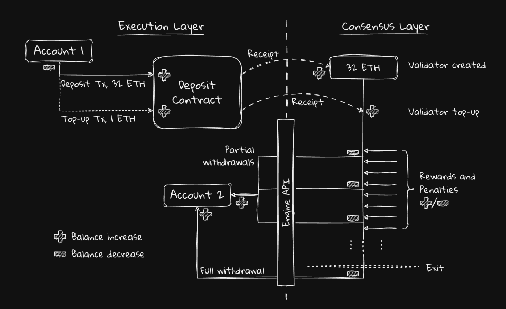

# Staking: Deposits and Withdrawals
[link](https://eth2book.info/capella/part2/deposits-withdrawals/)

## Overview
The capital is ETH, native currency of Ethereum.

Tips:
- Ether *on the consensus layer* exists separately, and is accounted for **separately**, from Ether in normal Ethereum accounts and contracts.
- **Ether on the consensus layer**:
    - in the form of **balances of validator accounts**.
    - Validator accounts are extremely limited: they have a balance that increases due to deposits and rewards, and decreases due to withdrawals and penalties.
    - **No Txs: Can not Transfer**;
- Tracking:
    - Validator account balances are **tracked** as part of the **beacon state**, and do not form part of the normal Ethereum execution state.
- Basic Procedure:
    - deposit in a specific contract;
    - on receiving:
        - emits a receipt;
        - consensus layer would pick this receipt;
        - a validator account is **created** and credited with the deposit amount;
        - staker may run the client to perform validation;
    - when staker have more than 32 ETH due to rewards:
        - extra ether would be sent to execution layer Ethereum account.
    - 
- ! An amusing observation from the diagram is that there is no minus sign attached to the deposit contract: the deposit contract's balance is **"up-only"** as validators exit and restake.

## Deposit
WIth staking CLI, "The application form" of Validation is formed as **deposit data**, for each validator:
- **pubkey**: later, it would be the unique id of this validator;
- **withdrawal_credentials**: Ethereum account that withdrawals will go to;
- amount: 32ETH
- signature: it's a **signature of previous 3 fields** with our private key.

## Top-ups
These are deposits for validators that already exist. You might want to top-up a validator if its effective balance falls below 32 ETH in order to restore it to maximum effectiveness.

## Deposit Contract

Key Takeaway:
- The deposit contract is the protocol's **entry point** for staking.
- Anybody may **permissionlessly** stake 32 ETH via the contract.
- On receiving a valid deposit the contract emits a receipt.
- An **incremental Merkle tree** maintains a Merkle root of all deposits.
- The deposit contract cannot verify a deposit's BLS signature.
- The balance of the deposit contract never decreases.
- Ether sent to the deposit contract should be considered burned.

Tips:
- Staker need to provide his private key to the consensus client to BE the staker according to the registration.
- Proof of Possession to prevent Rogue publick key attack derived from BLS Key;
    - TBD
- Un-Passed Deposit will be reverted.
- The contract will not do the validation since no crpto support within the contract. The signature will be validated later by the **consensus layer**;
    - If Deposit failed in this step, Ether would **loss**;
- The deposit contract was deployed on October the 14th, 2020, at 09:22:52 UTC to Ethereum address 0x00000000219ab540356cbb839cbe05303d7705fa.

Contract Code:
- omitted

## Deposit Processing

Key Takeaway:
- The consensus layer commits to the state of the deposit contract after an 8 hour delay, with a 2048 slot voting period.
- The delay and voting are no longer necessary post-Merge and may be removed in future.
- When a new deposit root is voted in, proposers must include deposits in blocks.
- The block proposer makes an inclusion proof of the deposit against the contract's deposit root that all nodes can verify.
- Deposits for new public keys create new validator records.
- Deposits for existing public keys top up validators' balances.

