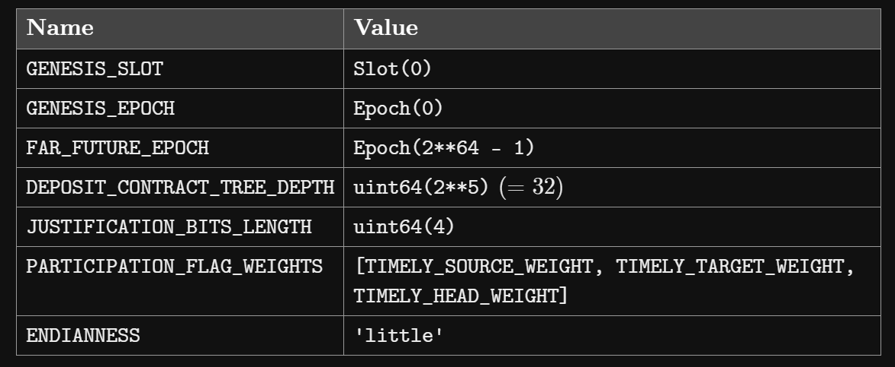
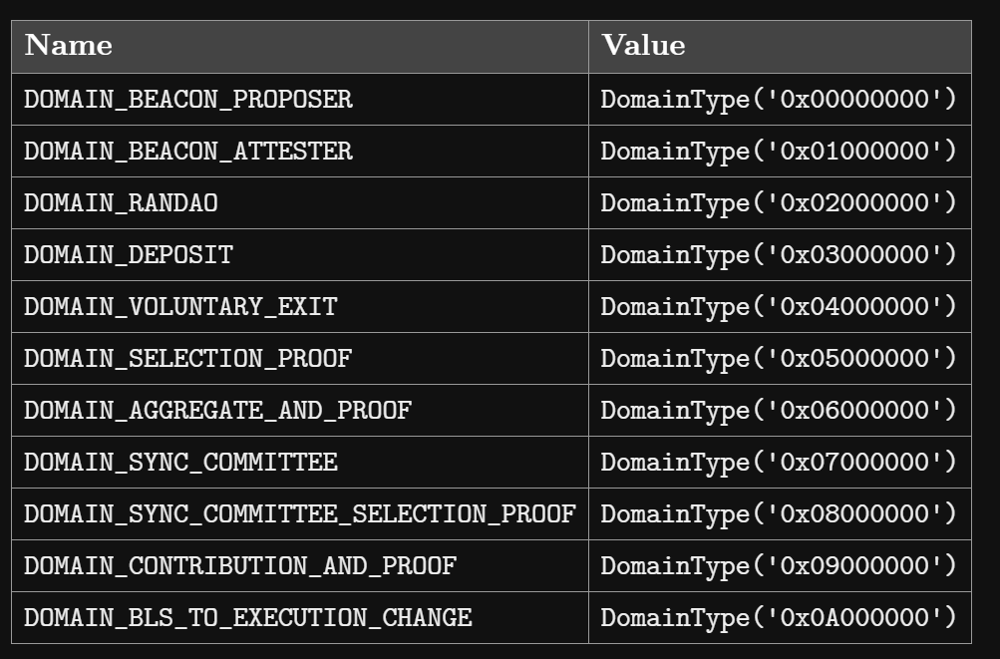
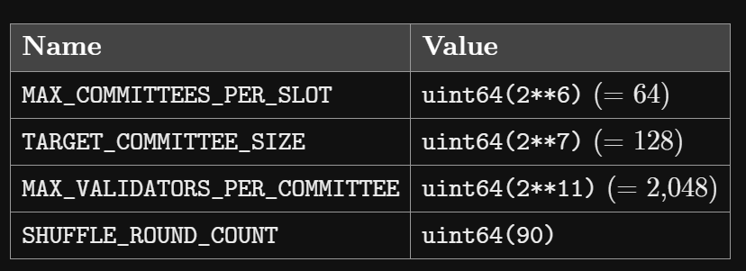
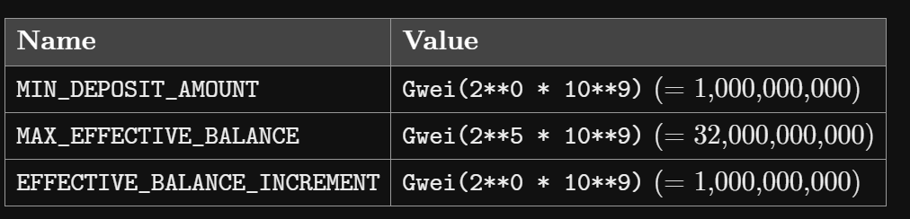
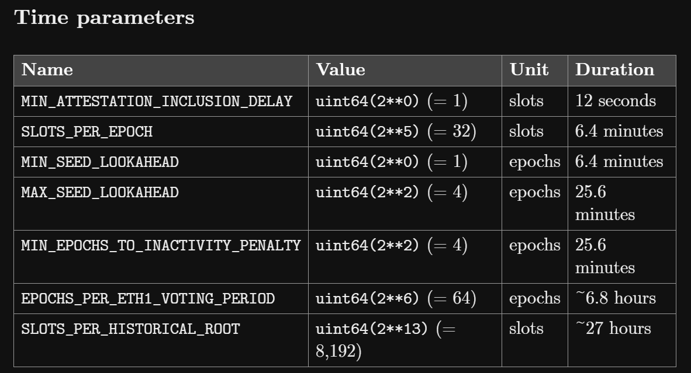

[eth2book-3.2-types etc.](https://eth2book.info/capella/part3/config/)

# Elements
## Custom Types
**Slot**:
- in one slot, one validator is randomly selected to propose a beacon chain block.

**Epoch**:
- Epoch boundaries are the points at which the chain can be justified and finalised (by the Casper FFG mechanism).
- *state-transition* work is performed per epoch, not per slot.
- They are also the points at which 
    - validator balances are updated, 
    - validator committees get shuffled,
    - validator exits, entries, and 
    - slashings are processed.
- Epoch-Less solution:
    - [Epoch-less Casper FFG liveness/safety argument](https://ethresear.ch/t/epoch-less-casper-ffg-liveness-safety-argument/2702?u=benjaminion)
    - [A model for cumulative committee-based finalit](https://ethresear.ch/t/a-model-for-cumulative-committee-based-finality/10259?u=benjaminion)

**Committee**:
- The beacon chain's [committee-based design](https://eth2book.info/capella/part2/building_blocks/committees/) is a large part of what makes it practical to implement while maintaining security.
- [?] several committees are active at each slot...

**Validators**:
- ValidatorIndex is unique and permanent, remaining even after validator exits;

Gwei:
- 1 Gwei == 10^9 Wei == 10^-9 Ether

Root:
- Merkle roots are ubiquitous in the Eth2 protocol.
- [tamper-proof example](https://en.wikipedia.org/wiki/Accumulator_%28cryptography%29)
- summarize: blocks / state / Eth1 deposits list 
- digital signature of a message contains the merkle root.

Hash32:
- a Eth1 block roots (also merkle root);
- The hash function is arguably the single most important algorithmic innovation underpinning blockchain technology, and in fact most of our online lives. Easily taken for granted, but utterly critical in enabling our modern world.

Version:
- Ethereum's update/upgrate number;
- actually a Hard-fork;
- `Version` is used to compute `ForkDigest`.

DomainType:
- to tag messages  with different purposes;
- 11 types in [Capella](https://eth2book.info/capella/part3/config/constants/#domain-types)

**ForkDigest**:
- chain ID, generated by combining information gathered at genesis with the current chain Version identifier.
- two purposes:
    - 区分不同fork之间的票：Within the consensus protocol to prevent, for example, attestations from validators on one fork (that maybe haven't upgraded yet) being counted on a different fork.
    - 找到相同队友：Within the networking protocol to help to distinguish between useful peers that on the same chain, and useless peers that are on a different chain. This usage is described in the Ethereum 2.0 networking specification, where ForkDigest appears frequently.

Domain
- Domain is used when verifying protocol messages validators. 

BLSPubkey:
- BLS (Boneh-Lynn-Shacham) is the digital signature scheme used by Eth2.

BLSSignature:
- in order to sign messages...

**ParticipationFlags**:
- Epoch Boundary Processing make the first slot suffer from late block/votes:
    - Prior to Altair, all attestations seen in blocks were stored in state for two epochs. At the end of an epoch, finality calculations, and reward and penalty calculations for each active validator, would be done by processing all the attestations for the previous epoch as a batch.
    - This created a spike in processing at epoch boundaries, and led to a noticeable increase in late blocks and attestations during the first slots of epochs.
- With Altair, participation flags are now used to continuously track validators' attestations, reducing the processing load at the end of epochs.

WithdrawalIndex
- The WithdrawalIndex keeps track of the total number of withdrawal transactions made from the consensus layer to the execution layer. All nodes store this number in their state, so a block containing withdrawal transactions that have unexpected withdrawal indices is invalid.
- Withdrawal: 提款交易，用于取共识验证收益或退出共识验证；
## Constants

**[?]JUSTIFICATION_BITS_LENGTH**:
- mainly about Casper;
- As an optimisation to Casper FFG – the process by which finality is conferred on epochs – the beacon chain uses a "k-finality" rule. We will describe this more fully when we look at processing **justification and finalisation**. For now, this constant is just the number of bits we need to store in state to implement k-finality. With k=2, we track the justification status of the last four epochs.

**PARTICIPATION_FLAG_WEIGHTS**:
- mainly about incentivization;

**Domain Types**:

types can be used in 3 ways:
- for seeds;
- for signatures;
- for selecting aggregators;

## Preset

MIN_DEPOSIT_AMOUNT = 1 Ether

MIN_DEPOSIT_AMOUNT is not actually used anywhere within the beacon chain specification document. Rather, it is enforced in the deposit contract that was deployed to the Ethereum 1 chain. Any amount less than this value sent to the deposit contract is reverted.

Allowing stakers to make deposits smaller than a full stake is useful for topping-up a validator's balance if its effective balance has dropped below 32 Ether in order to maintain full productivity. However, this actually led to a [vulnerability](https://medium.com/immunefi/rocketpool-lido-frontrunning-bug-fix-postmortem-e701f26d7971) for some staking pools, involving the front-running of deposits. In some circumstances, a front-running attacker could change a genuine depositor's withdrawal credentials to their own.

# 