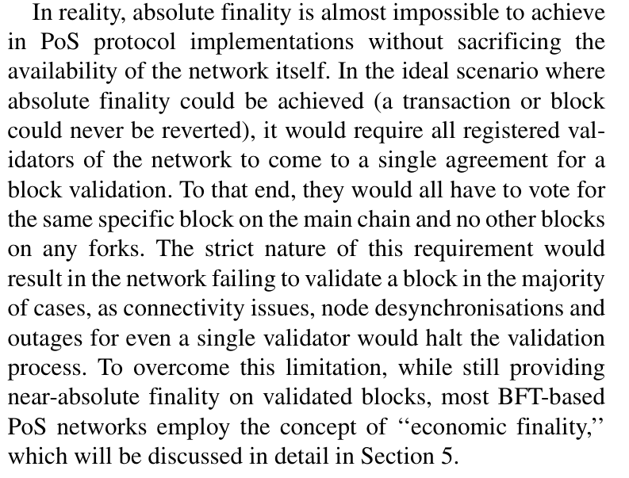
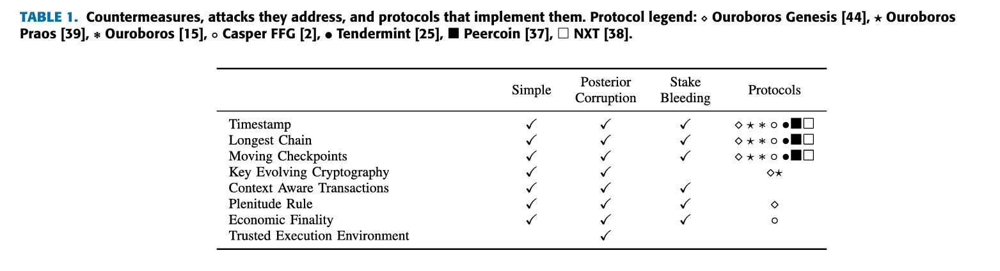

# A survey on long-range attacks for proof of stake protocols
[paper](https://ieeexplore.ieee.org/iel7/6287639/6514899/08653269.pdf)
# intro
definition: 
- Long-range: long range attacks are forks of the blockchain which may fork it even from the genesis block. 

Probabilistic Finality: 
This type of nality is achieved by **consistently reducing the likelihood** of a transaction or block being altered or reverted, the deeper this block is located within the blockchain.

PoS have two types:
- Absolute Finality: reach consensus per round.
- Probabilistic Finality: after blocks to reach consensus

# Attacks:
Double Spend:
- one of the ultimate goals of consensus attack;
- absolute finality are considered robust against the double spend;

Sybil Attack:
- to make fake accounts into the network to cheat the system that you have greate impact.
- PoW and PoS are Sybil Attack Resistence methods;

Race Attack:
- implementation issue about probabilistic finality;
- some transactions would be considered as valid within the recommendation period, as a weak valid;
- attacker can exploit such gap to double spend;

BRIBERY ATTACK:
- to collude other validators to corrupt the network;

Liveness Denial(finality?):
- there are some punishment, like inactivity leakage;
- being in-active should be punished for sure;

Censorship:
- blacklist like TC
    - Tornado Cash/ mixing service;
    - 去中心化混币服务，旨在通过打破交易的链上可追溯性来增强用户的隐私。它允许用户将加密货币（如 ETH 或 ERC-20 代币）存入一个智能合约，然后从另一个地址提取等量的资金，从而隐藏原始资金的来源和去向。
    - 基于零知识证明的技术zk-SNARKs提供进一步匿名化；
- zk-SNARKs：
    - Zero-knowledge succinct non-interactive arguments of knowledge；
    - can be used to hide the identity of the transaction sender；

51% Attack:
- majority attack;
- in PoW, probabilistic block gen makes even 51% power will have a lot of branchs;
- in PoS, similar on 34% stake power;

Selfish Mining:
- block withholding;

Others:
- Grinding attack:
    - precomputation attack
        - By exploiting the lack of randomness in the slot leader election process, a slot leader is capable of manipulating the frequency of them being elected in subsequent blocks.
    - coin age accumulation attack:
        - time accumulation for attackers, makes them stronger;
        - later the time factor is **capped**;

# Long-Range Attack:
can be divided into 3 types:
- simple:
    - to win the competetion by timestamps forging, building blocks faster;
- posterior coruption
    - retired validators to sign stale blocks;
- stake bleeding
    - bleeding others in the fork and becomes stronger on the fork to produce more blocks;
    - bleeding self on the main chain, to slot down its pace;
    - and in the last TX, attacker redistributes the stake to other validators;
    - release the branch;
    - very slow. 30% stake would take 6 years;

# Mitigations
longest chain
- Note that even though the transactions in the other branch do disappear, they are not entirely destroyed. hey are shifted to the pool of uncon rmed transactions where they might be placed into a subsequent block.

moving checkpoints: eth use this;

key-evolving cryptography:
- to prevent retired validators to sign old blocks;
- Key-Evolving-Signature(KES): 
    - the lifetime of the key is divided into epochs for which a different private key is used, yet the public one remains the same. 
    - Therefore, the epoch that the signature was issued becomes an integral part of the whole signature. As a result, even if a key is leaked it cannot be used to re-sign older messages.

CONTEXT-AWARE TRANSACTIONS:
- With Context-Aware Transactions, we are moving this link one step further by including the **hash of a previous block** inside a transaction [42].
- TXs can not be copied to another branch;
-  Recently, Coleman proposed the use of **Universal Hash Time** which is a type of Context-Aware Transactions [43]. Universal Hash Time uses hashes of time to establish transaction references bound to speci c points in time.
-  While it does not eliminate the attack, it introduces a substantial obstacle as the attacker is forced to create an entirely different history which signi cantly decreases its impact.

Plenitude Rule:
- from PoS chain Ouroboros Genesis [44];
- This chain selection rule is based on detecting the **sparsity and density** of blocks in conflicting branches.
- bad chain is always less denser than the correct one.

Economic Finality:
-  Even though Economic Finality does not eliminate Long Range attacks, it does make them much less probable as validators are now further disincentivised in conducting any sort of attack against the network.

**TEE(Trusted Execution Environment)**
- the private/public key is gen-ed within TEE and will never leave TEE, then they can not be leaked.
- no leaked private key, no long-range attack.

# conclusion:
Therefore, it is being broadly adopted in various domains serving as the backbone of many applications [46].

# Insight:
Inactivity Leakage
- how to determine a validator is in-active?
- vote? vote a wrong fork?

To mitigate re-org? new history is hard to forge.

Stake re-distribution?