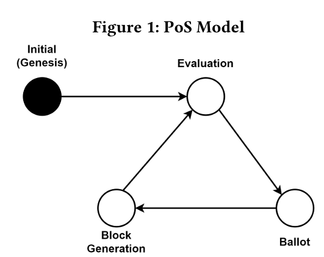
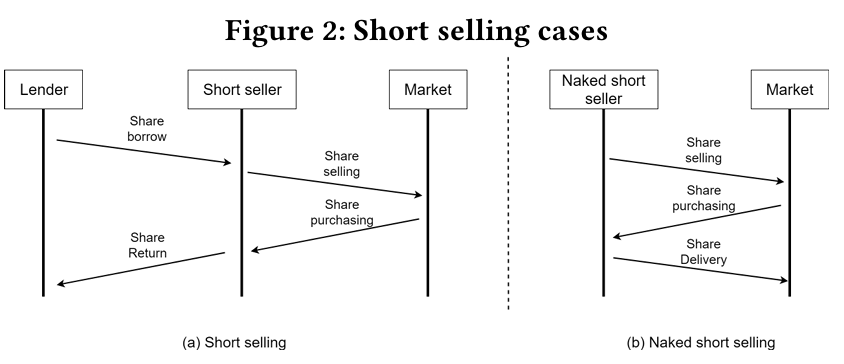
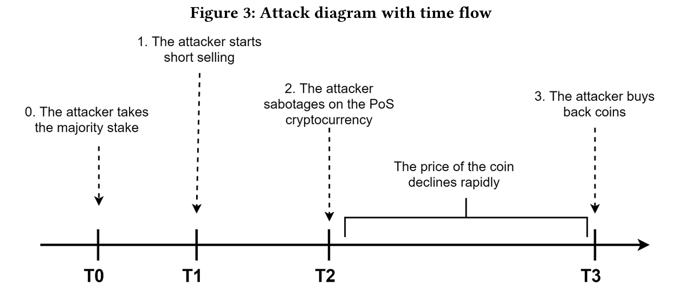
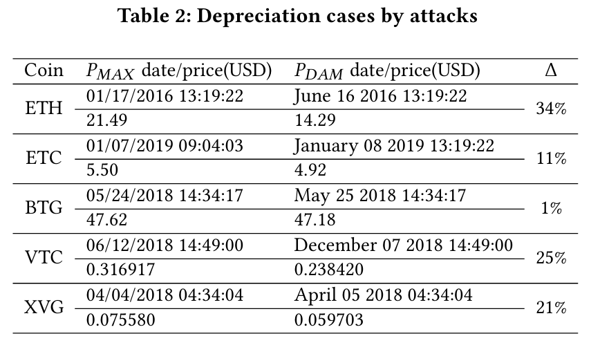

# Proof-of-Stake at Stake: Predatory, Destructive Attack on PoS Cryptocurrencies
[paper](https://dl.acm.org/doi/pdf/10.1145/3410699.3413791)

## Abstract
- unlike PoW, the attacker in a PoS system is highly discouraged from launching a 51% attack because he would have to risk losing his entire stake amount to do so.
- Evan it succeed, the **value of native token would fall**, then the attacker would also suffer loss.
- So straightforward 51% would even lose money. In this paper, we present a way to win money!
- we propose a **predatory, destructive attack** on PoS cryptocurrencies.
-  Our findings are an example to show that the conventional myth that “a destructive attack that destroys the blockchain ecosystem totally will not occur because it is **fundamentally unprofitable** to the attacker itself" may be wrong.

## Notes
Intro:
- 51% attack in PoW -> PoS -> 51% in PoS -> **Not be easily motivated** for reasons;
- Our work:
    - new attack make it fully benefit the attackers;

PoS Model:
- very basic PoS withour slashing and only 4 states: 

Attack:

Margin Trading保证金交易/杠杆交易；

# Insights
Tips:
- first-ever blockchain project to use the PoS model was **Peercoin**;
- security comes from putting up economic **value-at-loss**;
- Assumption: The cryptocurrency system’s value is on the functionality of transactions
    - how to understand the value of cryptocurrency.