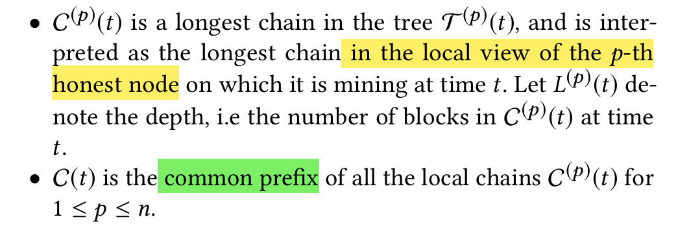

# Everything is a Race and Nakamoto Always Wins

## Abs:
Bitcoin itself claim its security against private double-spend attack, but is this attack the worst case?

The paper answer this question clearly under 3 PoW protocols.

Thesecurity analysis of these protocols is performed in a unified manner by a novel method of **reducing all attacks to a race between the adversary and the honest nodes**.

## Note:
Longest chain PoW, invented in Bitcoin
-> later is used in diff chains
-> even for PoS chains

Most important is security, that is, how many resource is need for a revertion?

Nakamoto analyzed this by using private attack as **worst case**.

A important pair (λ, Δ), block rate and network delay. And when their product is small and even near zero, the β can reach 0.5.

the pair become a trade-off, bigger: 
- better performance and wider network delay tolerance
- worse security.

Research Question: 

`β^{PA} != β^{*}` and the gap grows when the pair grows.​

Contri:
- True Threshold == PA threshold;
    
- Attack reduction
    - All attack can be reduced to a race.

Key concept:
- blocktree partitioning: into multi- sub-trees with only bad block;
- nakamoto blocks: stable blocks;

General Attack: different strategies to compromise the safety issue.

## Related Works:

GKL15 proposed properties of blocktree to analyze under **lock-step round-by-round model**:
- common prefix
- chain quality
- chain growth

About common prefix:
- uniquely successful honest block:
    -  the only honest block mined in a round.

## Models:
Bad nodes can delay their blocks for Δ time;

Models:

Settings:

Bad Capabilities:

Comment:
- A1: 敌在暗我在明，敌人拥有全局视野；
- A2：敌人与全局交流时也会有网络延迟；

## Key concepts:

Now:
- 当t从第j个好块出生开始直到永远，第i个好块引出的恶意树的深度小于好链从第i个好块开始的长度，即i处的恶意树从j块出生后，就永远也赢不了了。
- 当j块之前的所有恶意树都永远也赢不了的时候，就认为j块是Nakamoto block；

- 证明：nb在common prefix上：
    - 反证法：假设nb不再common prefix上：
        - 在p的view中，从t*开始，nb的chain不在common prefix上；
        - 可以是p自己挖了几个块，然后用恶意块reorg了原本的nb块；
            - 此处不可能通过好块协助reorg，因为一定是自己先reorg才会让好块跟着reorg的；
            - 可通过反证得到：若有一个好块在t*前，又在nb块之后，则说明在好块出前这个好节点就已经认为nb chain 不在common prefix上了；
            - 则恶意链的好块一定在nb的common prefix上；
            - 则恶意链一定全在以这个好块为基础的恶意树上；

- 在网络无延迟的情况下，一旦出现一个honest的nb，即一个好块赢了所有恶意树，这个好块是一定会在系统里广播的，那么好人就都得到了好块，这个最前沿的好块会让好人们再也不受这个好块之前的恶意树打扰；
- 之前的恶意树哪怕集结起来专攻一条恶意链，也不可能赢过好人了，因为好人的总算力默认大于坏人；

- 但是在有延迟的情况下，这个好块哪怕出现了，也可能会丢了，下一个好块正好把这个好块reorg了；
- 好人难以在有延迟的情况下齐心协力；

- 两个问题：
    - 一个块哪怕赢了nb的race，即之前的恶意树跑不过自己，由于延迟也不一定是留存的块，因为可能有多个赢家；
    - 一个nb，无法再通过算力优势确保不输给private了，因为nb后的诚实力量可能分片；

第一个问题的解法就是要求nb必须是loner；

- 可以通过ren19学习一下：
    - 普通节点在网络中如何delay信息导致可信部分分叉；
    - loner;
    - convergence oppotunities，实在不行就PSS17。。。

Loner: 

- 我在t收到了h，则t-Δ之前，一定没人收到h，也只能和h一层；
- 而在t+Δ之后，好人都收到了我的h2，一定会长在我上面一层；

第二个问题来看看分析，先预想一个Worst-case

