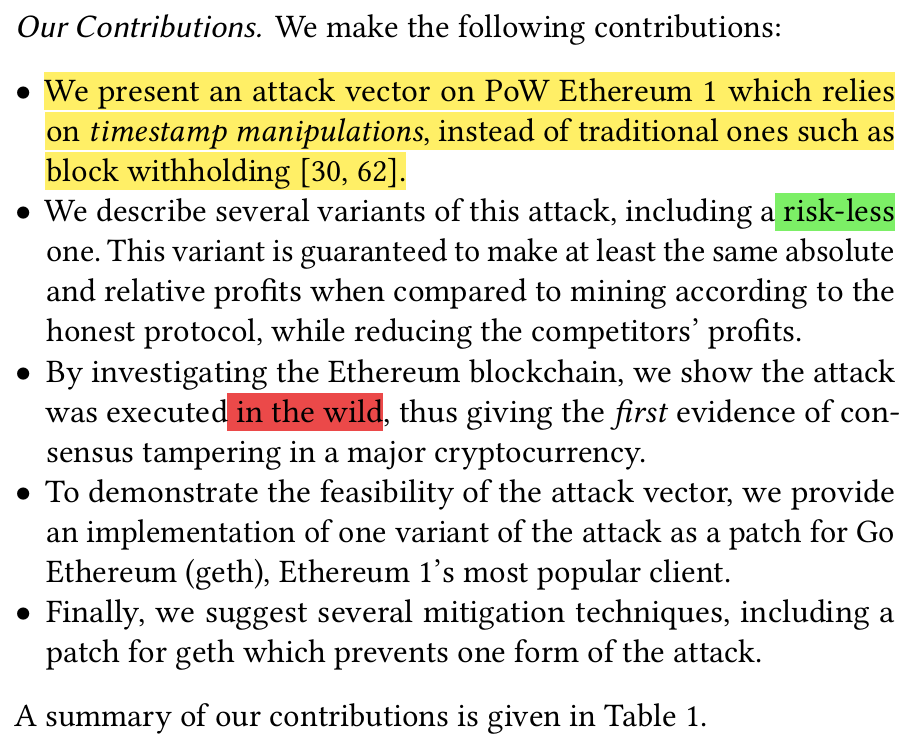
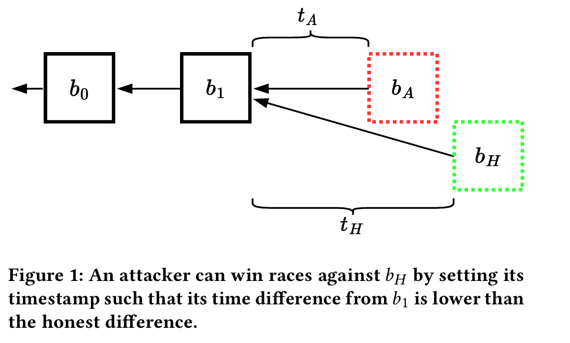
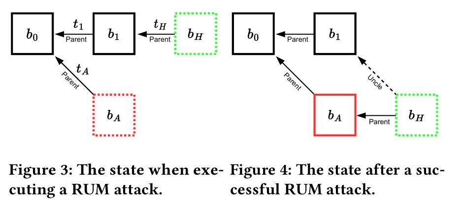
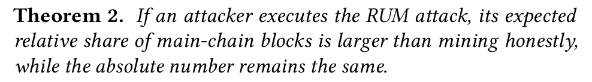
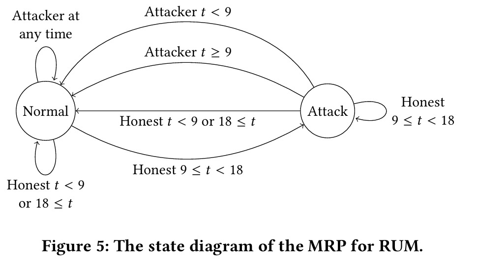

# Uncle Maker: (Time)Stamping Out The Competition in Ethereum
[the paper](https://dl.acm.org/doi/pdf/10.1145/3576915.3616674)

## Summary
Find a trivial issue which could affect fork choice and then design an attack to leverage such DAA issue to win fork when the target is benign.

can not increase rewards imediately but can decrease benign validators' reward, wasting their effort. Then the share of attackers may arise.

## Notes
Abstract:
- Attack eth1.0 to allow miners's higher rewards.
- This attack is novel in that it relies on manipulating block **timestamps** and the **difficulty-adjustment algorithm (DAA)** to give the miner an advantage whenever block races ensue. We call our attack Uncle Maker, as it induces a higher rate of **uncle blocks**.
- Our attack differs from past attacks such as **Selfish Mining** [30], that have been shown to be profitable but **were never observed in practice**.

Intro:
- Attack:
    - Timestamp manipulation for a higher-difficulty block, which would be preferred by the Ethereum 1's Consensus Algorithm.
    - More profitable than benign choice.
- Claim:
    - Other timestamp attack is only **theoretical** and **low success rate**.
    - Our attack **existes in real** Ethereum.
    - No consensus level manipulation has been observed. 
    - Our attack is the **first Observed Consensus Level Attack** so far.
- DOes:
    - novel attack via novel vector, i.e. not withholding.
    - its effect: risk-less and more or equal profit.
    - Real-one in the wild. First Consensus Attack so far.
    - Feasibility Experiments.
    - Potential Mitigation

Attack Overview:
- Ethereum 1’s **DAA** causes a slight increase in the difficulty of mining **if blocks are mined too quickly**, and a slight decrease if blocks are mined too slowly. 
- As clocks are not perfectly synchronized between nodes, **timestamps** are essentially “cheap-talk”. They can be set by miners **as desired**, but are still required to grow monotonically and cannot be too far into the future. This allows block creators to slightly **change the difficulty** of the block. 
-  Such small changes do not make mining much harder, but can affect which block nodes choose to extend in case two **conflicting** blocks of the same height are mined. 

Profits:
- Theorem 2 that an attacker’s relative share of mainchain blocks **exceeds** the **fair** share that can be obtained honestly.
- share inc, and absolute profit remains the same.

MRP, it's about state space:
- Normal:
    - conditions when our attack can **NOT** be performed. Thus, attacker mines normally.
- Attack:
    - conditions when requirements are met.

State Transitions:
- A->N: Honest `[9, 18)`
    - where requirement meets and goto *Attack* from *Normal*;
- N->N: Honest `9),[18`
    - where requirement not meets and still in *Normal*;
- N->N: Attacker at any time
    - success to mine a block normally
- A->N: Attacker `9)`
    - **succeed** to mine a block to make an uncle.
- A->A: Honest `[9, 18)`
    - attack fails but the new block still meets requirements.
- A->N: Honest `9),[18`
    - attack fails and the new block can not be hacked.
- A->N: Attacker `[9`
    - attack succeed to mine a block but **after the time window**.

## Conclusion
Interesting Consensus attack on a different vector.

## Insights
Scrutinize the fork choice rule and find all elements to perform Consensus Attacks.

Maybe fuzzing can explore this problem.