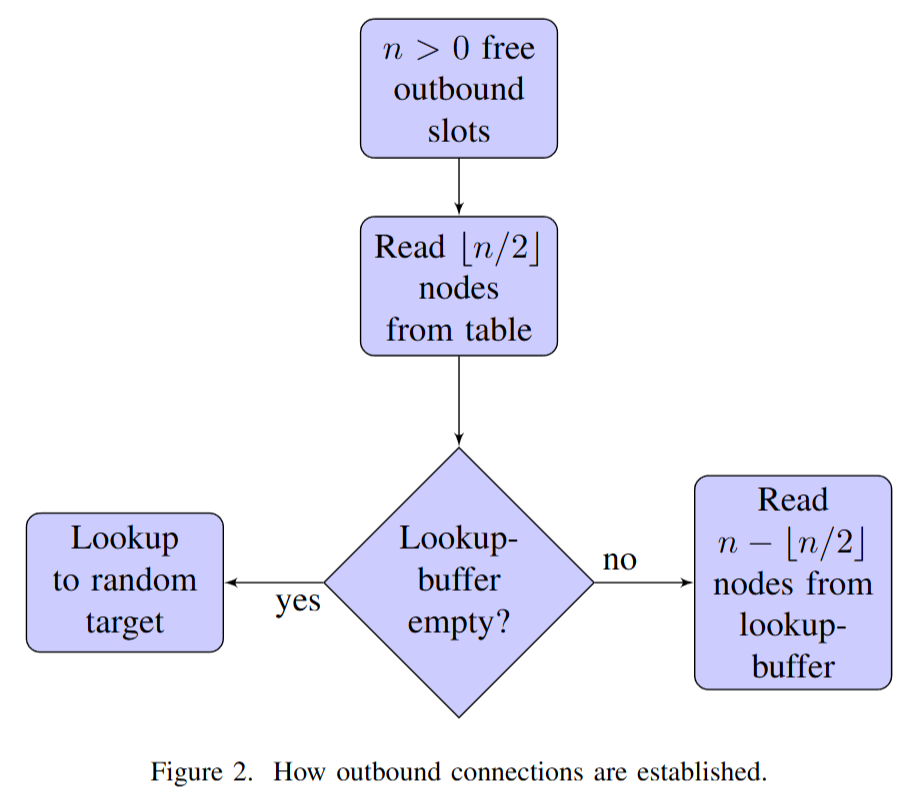

# Eclipsing Ethereum Attack
本文主要介绍并分析了针对以太坊主流客户端Go Ethereum（Geth）的一种新型网络层攻击——“虚假伙伴(Fake Friends)”攻击。该攻击属于“日蚀攻击(Eclipse Attack)”的一种，攻击者通过控制受害节点的全部入站和出站连接，从而能够过滤或篡改该节点接收到的区块链信息。文章的核心发现与分析包括：

1. **虚假伙伴攻击原理**：攻击者仅需两台位于不同/24子网的主机，就能低成本地控制远程、长时间运行的Geth节点，填充其25个TCP连接槽（8个出站、17个入站）。尤其是出站连接，由于Geth基于Kademlia的节点发现机制，只需在发现表每个桶中有一个虚假节点即可，极大绕过了此前的安全增强措施。

2. **以太坊网络层与安全短板**：Go Ethereum的节点发现、连接管理和对端选择机制复杂，且过度依赖节点ID，而节点ID容易被攻击者伪造和操作。这种以ID为核心的设计并不能有效阻止攻击者批量制造虚假节点来污染发现表，反而为攻击打开了方便之门。

3. **存在性与实验结果**：实验证明，即使不重启目标节点，只需等待区块链节点自然连接的正常更替（大多数连接不超过5.5天），攻击同样可在数天内完成。

4. **对策与建议**：作者不仅提出短期“修补”措施，也强调长期应替换节点选择逻辑。建议基于难以伪造的节点属性（如IP、实体权益抵押等）进行发现和连接选择，或者用更随机的节点采样方式，并保持足够大的对端池。 高价值节点（如矿工、大型商家）应主动手动维护可信连接。

**与区块链共识的关联洞见**：

- 节点全局信息一致性假设受到网络层日蚀攻击的直接威胁，节点一旦“被包围”，便可被引导至错误的链分支，进而危及如双花、固执挖矿等共识安全。
- 共识算法自身并不能完全防御网络层攻击，实现稳健共识还必须依赖底层网络健壮性、连接多样性和抗女巫攻击（Sybil-attack）的设计。
- 任何基于P2P发现和随机连接的区块链网络，都需警惕节点选择机制设计，否则再强的共识协议也可因网络层“信息孤岛”而崩溃。

## detail
- geth 1.8.0:
    - **discv4**: Peer discovery;
        - The discv4 node discovery is inspired by the Kademlia DHT [7]. 
    - **RLPx**: secure trans;
    - **DEVp2p**: session management;
    - 合计25个信道：17个入站，8个出站；
        - 攻击尤其要想办法污染其出站连接；
        - 出站连接的来源：
        - 注：每当outbound connecton**有空**时：
            1. 前一半直接从discv4的table表**读**；
            2. 剩下从lookup-buffer即Kademlia DHT算法来进行发现；
- Discovery table: 
    - detail omitted. check the paper;
- lookup-algo:
    - check the paper;