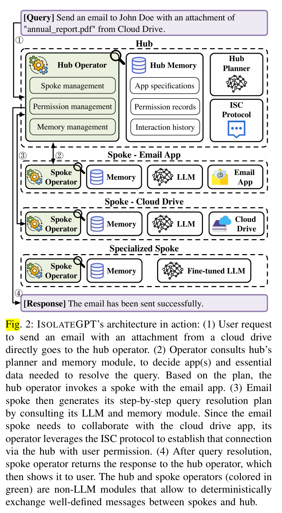

# IsolateGPT: An Execution Isolation Architecture for LLM-Based Agentic Systems
[paper](https://arxiv.org/pdf/2403.04960): A systematic framework to mitigate strong Agent.

## Summary
Agent is strong, and lack of isolation. Try to mitigate the security issue of Strong Agent via isolation.

## Notes
Abstract:
- LLM Apps == apps leverage natural language-based automated execution of LLMs;
- insufficient isolation
- work: a new design of LLM isolation

Intro:
- Problems so far:
    - natural language-based interactions are **not as precisely defined as** traditional programming interfaces.
    - unrestricted capabilities of agents have serious risks.
- solution:
    - well-defined **interfaces** with **user permission**;
    - just like MCP.
    - same functionality with non-isolation system.
- challenges:
    - user-transparent;
        - hub;
    - no loss of functionality;
        - spoke;
    - mutually distrusting apps to safely collaborate.
        - proposing an inter-spoke communication protocol;

Arch:

## Insights
Agent protocol Fuzzing like MCP. Interfaces between model and tools can be fuzzed.
