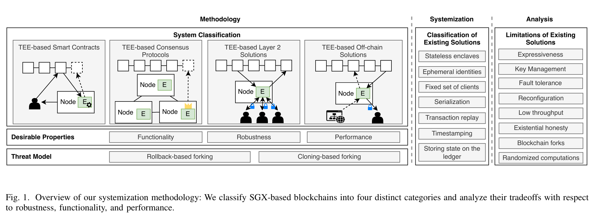
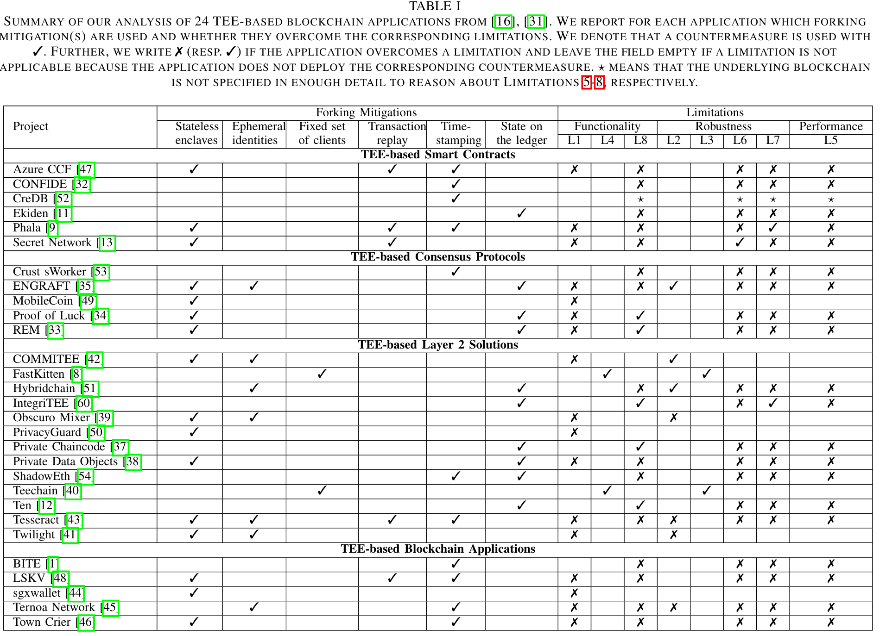

# The Forking Way: When TEEs Meet Consensus
[paper](https://arxiv.org/pdf/2412.00706)

TEEs bring confidential computing to the blockchain while the consensus layer could help defend TEEs from forking attacks.

## Intro:
WAys for privacy:
- trusted third party;
    - third party to use TEE to execute;
- zk-rollups;
- Secure-multi-party computation;
- TEE;

TEE is:
- more efficient and more expressive(than MPC);
- lower deployment costs

TEE can: 
- provide confidential computing for smart contracts
- validator doesn't care the real input/output and computing process, so they can **migrate execution layer into TEE**;

TEE suffers from **forking attacks**:
- rolling back attack: previous works' focus
- instance cloning attack: miss

## Background:
### TEE: 
- Trusted Execution Environments leverage the hardware to control access to runtime memory by software, thereby providing an isolated sandbox—known as “enclave”—to execute user code.
- Attestation/Enclave Identity:
    - **Attestation** allow remote verifiers to check that:     
        - code is running in enclave;
        - config of enclave;
    - **Enclave** would sign a hash over code and config with private key while the public key is distributed by TEEmanufacturer.
    - the hash is called **Identity**;
        - TEEs provide *no support to distinguish* enclaves with the same binary on the same platform.
- Sealing
    - secure storage via  authenticated encryption
    - sealing keys.
    - 2 enclave can not access same sealing key.
    - **Has no freshness guarantees.**
### Forking Attacks
- consistency threats of distributed apps.
- In the context of TEEs, a forking attack leverages the lack of freshness of the sealing functionality or the lack of mechanisms to distinguish two instances of the same enclave application:
    - rollback-based forking;
        - revert some state and the TEE can not be aware.
    - cloning-based forking;
        - not possible to distinguish the two instances apart;

## Methodology

Classification:
- TEE smart contract:
    - for confidential execution of contracts;
    - TEE fetches encrypted inputs from L1, processes the TX, push the encrypted outputs back to L1.
- TEE consensus
    - secure leader election
    - secure execution of consensus protocol
- TEE L2
    - for chains don't surpport confidential contracts, TEE L2 can provide such services.
    - others: mixers / channels / cross-chain;
- TEE apps:
    - secure **fetching required data** like blocks.

mainly focus on different application targets:
- contract / consensus / L2 / apps;

Using of TEE would always suffer Forking Attacks, then they need to address such problems.

Key tech to defend:
- stateless enclaves;
- ephemeral enclave IDs;
- fixed set of clients that monitors the enclave to detect forks;
- serialize the enclave state by using the ledger.

# Key figures:

##