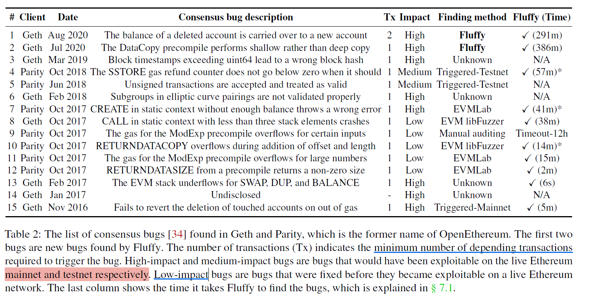

# Overall
Bugs in EL client Geth to make consensus failure.

Fuzzers:
- [18, 22, 33, 34].
- Jiang Yu: 
    - FSE19: EVMFuzzer: Detect EVM Vulnerabilities via Fuzz Testing.

Limitations:
- chain state model can not cover full space for consensus bugs. They have **limited pre-TX state**.
- ignore of **program** state;

Method:
- to test multi-TXs per time, indirectly have various pre-TX state;
    - TX dependency and context mutation;
- new model to cover whole program;

Model diff:
- chain state model:
- client program state model:

# background
## the diff:
- client program state: all program data;
- chain state: subset of client program state;

case:
- setup1: initialize a state with TX 1;
- setup2: initialize a state without TX 1, then exec TX 1;

Key diff:
- chain state should be same but client state can be different, like number of executed TXs 0:1;

## consensus bugs
bugs due to implementation issue;

Known bugs:
- should cause error compared with right EVM spec;
- 

fuzzers.
- 

Impacts:
- use EVM bug to fork the chain;
- use EVM bug to steal money;

# Imple fuzzing:
Modify to fuzz;

multi-TXs gen with dependency/context mutation;

semantic-aware mutation for TX/TX para/EVM;

## note
- multi-TX dependency;
- TXs mutation with semantic-aware strategy;
- exec on multi-client;
    - records multi middle-states;
    - collect feedbacks: new states/ coverage etc.
- if new path then collect current case into corpus;
- if any middle-state is un-matched, crashes;

# Questions:
- single/multiple, other fuzzer would only test all TXs on the same one pre-TX state?
- 