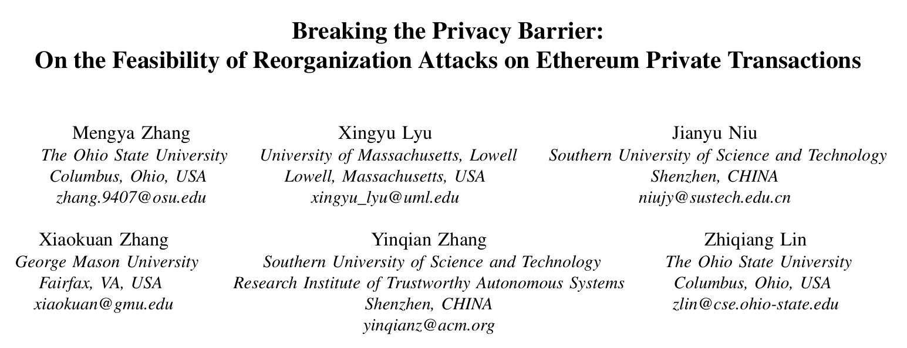
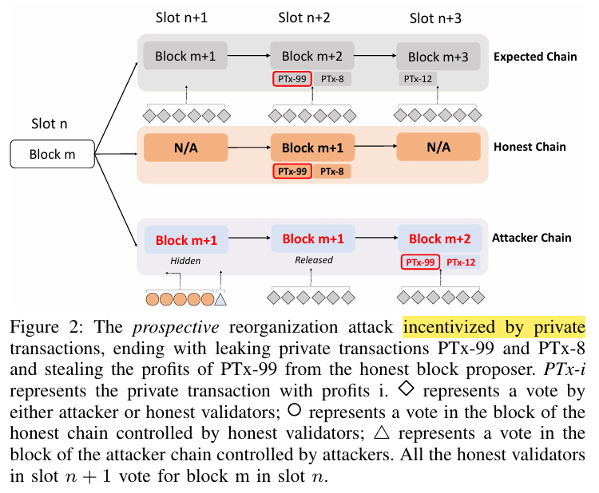
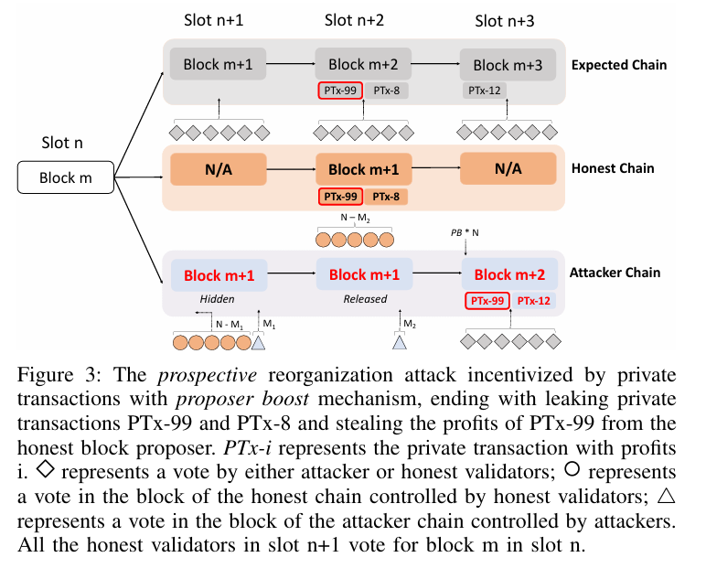
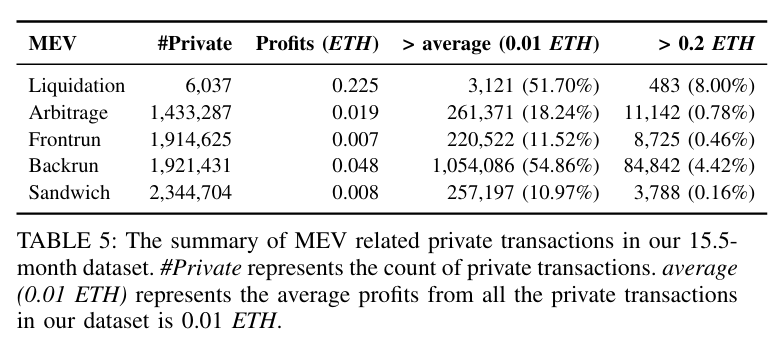

# Breaking the Privacy Barrier: On the Feasibility of Reorganization Attacks on Ethereum Private Transactions

[Paper](https://zhiqlin.github.io/file/ACSAC24.pdf)

## Summary
Private Transactions have more profits, especially for MEV context. So the exposure of Private TXs can lead to Profit hijacking. 

Re-org Attack is a hard fork on the chain. The chain would revert to the fork-block and go to another different branch. Everything on the chain would be different on another branch. Confirmed Private Transactions would no longer exist. So when re-org happened, private TXs on the original branch would be "leaked" to MEV hunters.

## Comments
Writing:
- background of Consensus is not strong.
    - hide ==> withdraw
- attack is not well-presented
- too many background, even after 4 pages we still don't know the work done by the paper.

---

Attack:
- strong assumpetion: 2 proposal requirements.
- very similar to the very basic Re-org Attack, while the key detail of such attack is not well-presented.
    - in the "strategy", since the current vote for honest chain is 0?? why? no reason.
    - hell. I'm wrong.
    - withheld block proposed by hacker could always win the Fork by withheld votes. the very basic idea.
- The probability analysis of Prospective Re-org is not thorough.
    - assumes the profit distribution is flat among all slots.

---

Attack with Proposer Boost:
- still very similar with the basic sandwich Re-org...

---

Real Data:
- from 9.15.2022 to 12.31.2023
- 499,327,807 TXs in 3,371,501 Blocks
- in 2022/23, 148.1 Txs in one block on Ethereum PoS.
- in 2022/23, 74.18% blocks contain Private TXs.
- in 2022/23, private TXs average profit 0.13 ETH.
- MEV and Private TXs:

| 指标 | 数值 |
|------|------|
| 总交易数 | 499,327,807 |
| 总区块数 | 3,371,501 |
| 平均每区块交易数 | 148.1 |
| 包含隐私交易的区块比例 | 74.18% |
| 隐私交易平均利润 | 0.13 ETH |

---

Feasibility: real-one has done
- 8.325 forked slots from [Beaconcha.in](https://beaconcha.in)
- validator ID/specific votes: [QuickNode]( https://www.quicknode.com/docs/ethereum/eth-v1-beacon-states-\%7Bstate_id\%7D-committees)

## Conclusion
- Insight: Profit of Private TXs can be exposed when re-org happens.
- Desigh of steal profit from Private TX via Re-org;
- Analysis on the success rate;
- Data Analysis on real-world data:
    - Private TXs
    - MEVs
    - similar Attacks so far on the chain

## Insights

My Takeaway:
- Reveal the implication of low-cost Re-org on Private TXs and MEV.
- Private Tx is highly connectet with MEV.

- TX's Representation:
    - Hash
    - Block Number
    - Sender
    - Receiver
    - Value(Ether)
    - Input
    - Index
- In Geth, you can collect all block data.

Tools:
- Open-source tool to fetch on-chain data: [EthereumETL](https://github.com/blockchain-etl/ethereum-etl)
- Private TXs Label: [Blocknative's Mempool Data](https://www.blocknative.com/)
