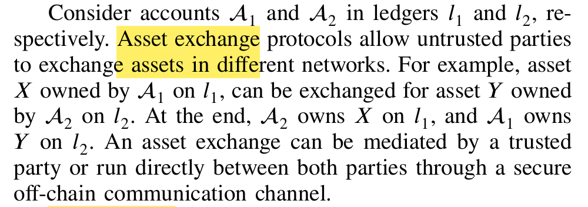

[paper](https://web.ist.utl.pt/~ist190704/sok_security_and_privacy_of_blockchain_interoperability.pdf)

# SoK:Security and Privacy of Blockchain Interoperability

## Abs
Cross-chain tech. 
Cross-chain hack about 3.1 Billion USD.
problem: Interoperability issue about -> overall framework flaw and user experience.
In this paper:
- systematic literature review;
    - 58 papers;
    - 154 

Findings:
- ...

## Notes
Contexts:
- Multi-chain arth improve all functionalities.
- **interoperability between `n` distributed systems**;
- This area called Interoperability Mechanisms(IMs) 
- This area is hard...
- New archs and sollutions? a lot;
- underscores the pressing need for rigorous research on IM sec.

Research perspective:
- what it is: a new boundary between chains;
- why it's a problem: 
    - why: chains themself has limitations;
    - Reality: cross chain TXs;

Real world data:
- loss over billions blabla...

RQs:
...

Methodology:
- papers from google scholar;
- gray literature resources about: A, B, C etc.

Primer:
- Blockchain interoperability allows data and value to flow across different domains and is facilitated by an IM.
- Interoperability Modes:
    - The literature..A,B,C etc. agrees on ...
    - 3 modes:
        - asset exchanges
            - like this:
        - asset transfers
            - lock-mint or burn-mint pattern;
        - data transfers
    - diff mode has diff protocols

The security of a cross-chain system can be decomposed into the security of several layers. The existing literature supports similar breakdowns [48]. 

# Reading:
- the term IMs from the paper [*Do You Need a Distributed Ledger Technology Interoperability Solution?*](https://doi.org/10.1145/3564532)
    - VB's Paper: [Chain interoperability](https://cognizium.io/uploads/resources/R3%20Corda-Vitalik%20Buterin%20-%20Chain%20Interoperability%20-%202016%20-%20Sep.pdf)
- [ETH Relay](./Grok-ETH-relay.md)
- [Better Cross-chain Exchange method SP19](./Grok-XCLAIM-sp19.md)